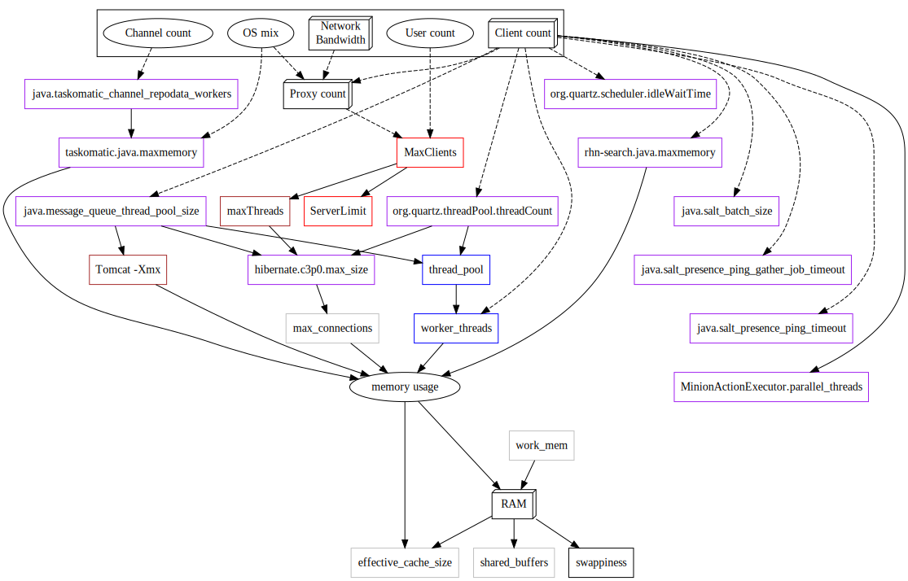

== Big Scale Deployment (1000 Clients or More)

{productname} can be installed and used in large and small installations. For installations with more than 1000 clients per {productname} Server, adequate hardware sizing and parameter tuning must be performed.

[NOTE]
.Maximum number of clients
====
There is no hard maximum number of supported systems. Any number of factors can greatly affect how many clients can reasonably be used in a particular installation, including which features are used, how the systems are configured and the hardware configuration.
====

=== Hardware and infrastructure

Appropriate hardware is an absolute necessity for big scale deployments, but be aware that not all problems can be solved with better hardware.

The minimum requirements for the {productname} Server are:

* 8 recent {x86} cores. Note that only x86-64-based {productname} deployments are currently supported for large installations this stage
* 32 GiB of RAM. 64 GiB or more for installations with thousands of clients
* fast I/O storage devices, such as locally-attached SSDs. Locally-attached RAID-0 SSDs for PostgreSQL data directories are recommended
* if the SUSE Manager Server is virtualized, the `elevator=noop` kernel option should always be set for optimal I/O performance

{productname} Proxy instances are also required:

* use one {productname} Proxy per 500-1000 clients
** the exact number of clients should be chosen taking network bandwidth considerations into account (see below)
* {productname} Proxy instances require at least 2 recent {x86} cores, 16 GiB of RAM and sufficient storage for caching
* clients should never be directly attached to the {productname} Server (except possibly a small number for testing purposes)

[WARNING]
====
Large installations require regular Salt minions, suggestions in this chapter assume no traditional clients or Salt SSH minions are employed.
====

[TIP]
.Number of clients per {productname} Proxy
====
{productname} Proxy's main functionality is to implement a local cache for content served to clients from the Server, thus, employing {productname} Proxies can substantially reduce download time for clients and Server egress bandwidth usage.

The choice of the number of clients per {productname} Proxy affects the download time and should be done taking into account the network structure and available bandwidth.

It is recommended to size the count of clients per Proxy by estimating the download time of typical content, eg. package upgrades for a quarter, if quarterly patching of clients is the expected use case.

Here is a rough example calculation of the total time needed to transfer 400MB worth of upgrades through a physical link speed of 1 GB/s to 3000 clients:

----
400 MB  * 3000 / 119 MB/s / 60 = 169 min
----

Formula is:

----
Size of updates * Number of clients / Theoretical download speed / 60
----
====

[TIP]
.Start Small and Scale Up
====
Always start small and scale up gradually.
Keep the server monitored in order to identify possible issues early.
====

=== Operation Recommendations

==== Salt Client Onboarding Rate

The rate at which SUSE Manager can onboard clients (accept Salt keys) is limited and depends on hardware resources.
Onboarding clients at a faster rate than SUSE Manager is configured for will build up a backlog of unprocessed keys slowing the process and potentially exhausting resources.
It is recommended to limit the acceptance key rate programmatically.
A safe starting point would be to onboard a client every 15 seconds, which can be implemented via the following command:

----
for k in $(salt-key -l un|grep -v Unaccepted); do salt-key -y -a $k; sleep 15; done
----

[[bp.chap.salt.minion.scaleability.unaccepted]]
==== Clients Running with Unaccepted Salt Keys

Clients which have not been onboarded, (clients running with unaccepted Salt keys) consume resources, in particular inbound network bandwidth for ~2.5 Kb/s per client.
1000 idle clients will consume around ~2.5 Mb/s, and this number will drop to almost 0 once onboarding has been completed.
Limit non-onboarded systems for optimal performance.

== Disabling the Salt Mine

In older versions, {productname} used a tool called Salt mine to check client availability.
The Salt mine would cause clients to contact the server every hour, which created significant load.
With the introduction of a more efficient mechanism in {productname}{nbsp}3.2, the Salt mine is no longer required.
Instead, the {productname} server uses Taskomatic to ping only the clients that appear to have been offline for twelve hours or more, with all clients being contacted at least once in every twenty four hour period by default.
You can adjust this by changing the [systemitem]``web.system_checkin_threshold`` parameter in [path]``rhn.conf``.
The value is expressed in days, and the default value is [literal]``1``.

Newly registered Salt clients will have the Salt mine disabled by default.
If the Salt mine is running on your system, you can reduce load by disabling it.
This is especially effective if you have a large number of clients.

Disable the Salt mine by running this command on the server:

----
salt '*' state.sls util.mgr_mine_config_clean_up
----

This will restart the clients and generate some Salt events to be processed by the server.
If you have a large number of clients, handling these events could create excessive load.
To avoid this, you can execute the command in batch mode with this command:

----
salt --batch-size 50 '*' state.sls util.mgr_mine_config_clean_up
----

You will need to wait for this command to finish executing.
Do not end the process with kbd:[Ctrl+C].

== Disable unnecessary Taskomatic jobs

In order to minimize wasted resources, consider disabling some non-essential Taskomatic jobs, especially if the provided functionality is not used.

Jobs that are safe to disable include:
* the daily comparison of configuration files.
Click menu:Admin[Task Schedules], then the btn:[compare-configs-default] link, then the btn:[Disable Schedule] button and finally btn:[Delete Schedule].
* the hourly synchronization of Cobbler files.
Click menu:Admin[Task Schedules], then the btn:[cobbler-sync-default] link, then the btn:[Disable Schedule] button and finally btn:[Delete Schedule].
* the daily run of Gatherer and Subscription Matcher.
Click menu:Admin[Task Schedules], then the btn:[gatherer-matcher-default] link, then the btn:[Disable Schedule] button and finally btn:[Delete Schedule].

=== Tuning
==== When is tuning needed?

{productname} Server and Proxy are installed with parameter default values that are expected to work well on any small-to-medium scale installation (below 1000 clients). Tuning should not be needed and is discouraged for small-to-medium installations.

For multi-thousand client installations, tuning is required for correct operation.

[WARNING]
====
Parameters described below can have severe and catastrophic performance impacts on your Server when improperly adjusted, in some cases also disrupting functionality completely.

Care should be taken when changing values, and performance should be monitored before and after each change, reverting any steps that do not produce the expected effect.

Testing of these altered values should also be performed within a test environment whenever possible.

ifeval::[{suma-content} == true]
SUSE Support and SUSE Consulting can help and should be involved in tuning.

SUSE will not be able to provide support for catastrophic failure when these advanced parameters are modified without consultation.
endif::[]
====

==== Tuning workflow

===== First installation

First of all, determine the "Tuning inputs" described in the paragraph below. Those are design variables, or design constraints, of your {productname} deployment and will be needed to determine all other variables later.

Then, consult the "Dependency graph" below:

* Tuning inputs are represented by graph nodes in a rectangle on top
* each node is connected with arrows to parameters that might need tuning. Consult the relevant parameter sections below for more information about recommended values
* tuning one parameter might require tuning other parameters, or changing hardware, or the infrastructure. Follow the arrows going out of each node that represent a parameter that has changed and repeat the process until no more nodes need to be visited

===== Re-tuning an existing installation

Re-tuning should be attempted:

 - whenever "Tuning inputs" (see First installation) change significantly,
 - if some special conditions arise that require a certain parameter to be changed (eg. specific warnings appear in logs, as detailed below) or
 - if performance is not satisfactory.

In that case, re-visit the "Dependency graph" following the same procedure described in First installation, starting from the nodes where significant change has happened.

===== Dependency graph

Key:

* 3d boxes represent hardware design variables or constraints
* ellipses represent software/system design variables or constraints
* rectangles represent configurable parameters, color-coded by configuration file
** red: Apache `httpd` configuration files
** blue: Salt configuration files
** brown: Tomcat configuration files
** grey: PostgreSQL configuration files
** violet: `/etc/rhn/rhn.conf`
* dashed arrows: a variable or constraint might require a change to another parameter
* solid arrows: changing a configuration parameter requires checking another one, as failure to adapt it might create issues

==== Tuning inputs

===== Network Bandwidth

A measure of the typically available egress bandwith from the {productname} Server host (to the clients or {productname} Proxy hosts). This should take into account network hardware and topology as well as possible capacity limits on switches, routers, and other network equipment between the Server and clients.

===== Channel count

The number of expected channels to manage, including any vendor-provided, third-party and clones/staged channels.

===== Client count

The total number of actual or expected clients. It is important to tune any parameters below in advance of a client count increase, whenever possible.

===== OS mix

The number of distinct OS versions that managed clients have installed, differentiated by family (SUSE Linux Enterprise-based, openSUSE-based, Red Hat-based or Ubuntu-based). Storage and computing requirements are different in each case.

===== User count

The expected maximum amount of concurrent users interacting with the Web UI plus the number of programs simultaneously using the XMLRPC API (including `spacecmd`, `spacewalk-clone-by-date`, etc.).

==== Parameters

===== `MaxClients`
* Description: the maximum number of http requests served simultaneously by Apache httpd. Proxies, Web UI and XMLRPC API clients each consume one. Requests exceeding the parameter will be queued and might result in timeouts. Note this parameter has been renamed to `MaxRequestWorkers`, both names are currently valid.
* Tune when: user count and Proxy count increase significantly and the following line appears in `/var/log/apache2/error_log`:
----
[...] [mpm_prefork:error] [pid ...] AH00161: server reached MaxRequestWorkers setting, consider raising the MaxRequestWorkers setting
----
* Value guideline: 150 (default) - 500
* Location: `/etc/apache2/server-tuning.conf`, `prefork.c` section
* After changing immediately change `ServerLimit` and also check `maxThreads` for possible adjustment
* More information on this parameter available at: https://httpd.apache.org/docs/2.4/en/mod/mpm_common.html#maxrequestworkers

==== `ServerLimit`
* Description: the number of Apache httpd processes serving HTTP requests simultaneously. The number must equal `MaxClients`.
* Tune when: `MaxClients` changes
* Value guideline: equal to `MaxClients`
* Location: `/etc/apache2/server-tuning.conf`, `prefork.c` section
* After changing immediately change `ServerLimit` and check `maxThreads` for possible adjustment
* More information on this parameter available at: https://httpd.apache.org/docs/2.4/en/mod/mpm_common.html#serverlimit

==== `maxThreads`
* Description: the number of Tomcat threads dedicated to serving HTTP requests.
* Tune when: `MaxClients` changes. `maxThreads` must always be equal or greater than `MaxClients`
* Value guideline: equal to `MaxClients`
* Location: `/etc/tomcat/server.xml`
* More information on this parameter available at: https://tomcat.apache.org/tomcat-9.0-doc/config/http.html

==== Tomcat's `-Xmx`
* Description: the maximum amount of memory Tomcat can use.
* Tune when:
** `java.message_queue_thread_pool_size` is increased or
** `OutOfMemoryException` errors appear in `/var/log/rhn/rhn_web_ui.log`
* Value guideline: 4 GiB to 8 GiB (default is 1 GiB)
* Location: `/etc/sysconfig/tomcat`. Note that the value has to be formatted as `-Xmx<N>G`, where `<N>` is the number of gibibytes to allocate
* After changing, also check the "Memory Usage" section below
* More information on this parameter available at: https://docs.oracle.com/javase/8/docs/technotes/tools/windows/java.html

==== `effective_cache_size`
* Description: an estimation of the total memory available to PostgreSQL for caching: the explicitly reserved memory (`shared_buffers` parameter) plus any memory used by the kernel as cache/buffer. Note that is just an estimation for the query planner, not an allocation.
* Tune when: hardware RAM or memory usage (as per the "Memory Usage" section) increase significantly
* Value guidelines:
 * 75% of total RAM as a starting point
 * `shared_buffers` + free memory + buffer/cache memory for a finer grained setting. Free and buffer/cache can be determined via the `free -m` command (`free` and `buff/cache` in the output respectively)
* Location: `/var/lib/pgsql/data/postgresql.conf`. Note that the value has to be formatted as `<N>MB`, where `<N>` is the number of mebibytes to allocate
* More information on this parameter available at: https://www.postgresql.org/docs/10/runtime-config-query.html#GUC-EFFECTIVE-CACHE-SIZE

==== `java.message_queue_thread_pool_size`
* Description: maximum number of threads in Tomcat dedicated to asynchronous operations, notably, handling of incoming Salt events
* Tune when: client count increases significantly
* Value guideline: 50 - 150 (default is 5)
* Location: `/etc/rhn/rhn.conf`
* After changing, also check for adjustment: `hibernate.c3p0.max_size` (each thread consumes a PostgreSQL connection, starvation might happen if the allocated connection pool is insufficient), `thread_pool` (each thread might performe Salt API calls, starvation might happen if the allocated Salt thread pool is insufficient), Tomcat `-Xmx` (each thread consumes memory, `OutOfMemoryException` might be raised if insufficient)
* More information on this parameter available at: `man rhn.conf`

==== `hibernate.c3p0.max_size`
* Description: maximum number of PostgreSQL connections simultaneously available to both Tomcat and Taskomatic. If any of those components requires more concurrent connections, their requests will be queued.
* Tune when:
** `java.message_queue_thread_pool_size` or `maxThreads` increase significantly. As each thread consumes one connection in Tomcat, having more threads than connections might result in starvation.
** `org.quartz.threadPool.threadCount` has changed significantly. Each thread consumes one connection in Taskomatic, having more threads than connections might result in starving.
* Value guideline: 100 to 200 (default is 20), higher than the maximum of `java.message_queue_thread_pool_size + maxThreads` and `org.quartz.threadPool.threadCount`
* Location: `/etc/rhn/rhn.conf`
* After changing, also check for adjustment: `max_connections`
* More information on this parameter available at: https://www.mchange.com/projects/c3p0/#maxPoolSize

==== `max_connections`
* Description: maximum number of PostgreSQL connections available to applications. More connections allow for more concurrent threads/workers in various components (in particular Tomcat and Taskomatic), which generally improves performance; on the other hand each connection consumes resources, in particular `work_mem` megabytes per sort operation per connection.
* Tune when: `hibernate.c3p0.max_size` changes significantly, as that parameter determines the maximum number of connections available to Tomcat and Taskomatic
* Value guideline: `2 * hibernate.c3p0.max_size + 50`, in any case below 1000
* Location: `/var/lib/pgsql/data/postgresql.conf`
* After changing, also check the "Memory Usage" section below. It is recommended memory usage is kept under close monitoring before and after the change
* More information on this parameter available at: https://www.postgresql.org/docs/10/runtime-config-connection.html#GUC-MAX-CONNECTIONS

==== `java.salt_batch_size`
* Description: the maximum amount of minions concurrently executing a scheduled Action.
* Tune when: client count reaches several thousands and Actions are not executed quickly enough
* Value guideline: 200 (default) - 500
* Location: `/etc/rhn/rhn.conf`
* More information on this parameter available at: xref:reference:salt-rate-limiting.adoc[Salt Rate Limiting]

==== `java.salt_presence_ping_timeout`
* Description: before any Action is executed on a client, a short command called a "presence ping" is executed to make sure the client is reachable. This parameter sets the amount of time before a second command (`find_job`) is sent to the client to verify its presence. Having many clients typically means some will respond faster than others, so this timeout could be raised to accommodate for the slower ones.
* Tune when:
** Client count increases significantly
** some clients are responding correctly but too slowly, thus {productname} excludes them from calls. In `/var/log/rhn/rhn_web_ui.log` the following line appears:
-----
"Got no result for <COMMAND> on minion <MINION_ID> (minion did not respond in time)"
-----
* Value guideline: 4 (default) - 400. Note that the value is expressed in seconds
* Location: `/etc/rhn/rhn.conf`
* More information on this parameter available at: xref:reference:salt-timeouts.adoc[Salt Timeouts]

==== `java.salt_presence_ping_gather_job_timeout`
* Description: before any Action is executed on a client, a short command called a "presence ping" is executed to make sure the client is reachable. After `java.salt_presence_ping_timeout` seconds have elapsed without a response, a second command (`find_job`) is sent to the client for a "last-chance" check. This parameter sets the number of seconds after the second command after which the client is definitely considered offline. Having many clients typically means some will respond faster than others, so this timeout could be raised to accommodate for the slower ones.
* Tune when:
** Client count increases significantly
** some clients are responding correctly but too slowly, thus {productname} excludes them from calls. In `/var/log/rhn/rhn_web_ui.log` the following line appears:
-----
"Got no result for <COMMAND> on minion <MINION_ID> (minion did not respond in time)"
-----
* Value guideline: 1 (default) - 100. Note that the value is expressed in seconds
* Location: `/etc/rhn/rhn.conf`
* More information on this parameter available at: xref:reference:salt-timeouts.adoc[Salt Timeouts]

==== `java.taskomatic_channel_repodata_workers`
* Description: whenever content is changed in a software channel, its metadata needs to be recomputed before clients can use it. Examples of channel-altering operations are the addition of a patch, the removal of a package or a repository synchonization run. This parameter specifies the maximum number of Taskomatic threads that {productname} will use to recompute the channel metadata. Channel metadata computation is both CPU-bound and memory-heavy, so raising this parameter and operating on many channels simultaneously could cause Taskomatic to consume significant resources, but channels will be available to clients sooner.
* Tune when: channel count increases significantly (more than 50), or more concurrent operations on channels are expected
* Value guideline: 2 (default) - 10
* Location: `/etc/rhn/rhn.conf`
* After changing, also check `taskomatic.java.maxmemory` for adjustment, as every new thread will consume memory
* More information on this parameter available at: `man rhn.conf`

==== `taskomatic.java.maxmemory`
* Description: the maximum amount of memory Taskomatic can use. Generation of metadata, especially for some OSs, can be memory-intensive, so this parameter might need raising depending on the managed OS mix.
* Tune when:
** `java.taskomatic_channel_repodata_workers` increase
** OSs are added to {productname}, in particular Red Hat and Ubuntu distributions and derivatives
** `OutOfMemoryException` errors appear in `/var/log/rhn/rhn_taskomatic_daemon.log`
* Value guideline:  2048 (default) - 16384. Note that the value is expressed in mebibytes
* Location: `/etc/rhn/rhn.conf`
* After changing, also check the "Memory Usage" section below
* More information on this parameter available at: `man rhn.conf`

==== `org.quartz.threadPool.threadCount`
* Description: number of Taskomatic worker threads. Increasing this value allows Taskomatic to serve more clients in parallel.
* Tune when: client count increases significantly
* Value guideline: 20 (default) - 200
* Location: `/etc/rhn/rhn.conf`
* After changing, also check for adjustment: `hibernate.c3p0.max_size`, `thread_pool`
* More information on this parameter available at: http://www.quartz-scheduler.org/documentation/2.4.0-SNAPSHOT/configuration.html

==== `org.quartz.scheduler.idleWaitTime`
* Description: cycle time for Taskomatic. Decreasing this value lowers Taskomatic's latency.
* Tune when: client count is in the thousands
* Value guideline: 1000 - 5000 (default). Note that the value is expressed in milliseconds
* Location: `/etc/rhn/rhn.conf`
* More information on this parameter available at: http://www.quartz-scheduler.org/documentation/2.4.0-SNAPSHOT/configuration.html

==== `MinionActionExecutor.parallel_threads`
* Description: number of Taskomatic threads dedicated to sending commands to Salt clients as a result of Actions being executed.
* Tune when: client count is in the thousands
* Value guideline: 1 (default) - 10
* Location: `/etc/rhn/rhn.conf`, full parameter name is `taskomatic.com.redhat.rhn.taskomatic.task.MinionActionExecutor.parallel_threads`

==== `rhn-search.java.maxmemory`
* Description: the maximum amount of memory that the `rhn-search` service can use.
* Tune when:
** Client count increases significantly and
** `OutOfMemoryException` errors appear in `journalctl -u rhn-search`
* Value guideline: 512 (default) - 4096. Note that the value is expressed in mebibytes
* Location: `/etc/rhn/rhn.conf`
* After changing, also check the "Memory Usage" section below

==== `shared_buffers`
* Description: amount of memory reserved for PostgreSQL shared buffers, which basically contain caches of database table and index data.
* Tune when: RAM changes
* Value guideline: 25% (default) - 40% of total RAM
* Location: `/var/lib/pgsql/data/postgresql.conf`. Note that the value has to be formatted as `<N>MB`, where `<N>` is the number of mebibytes to allocate
* More information on this parameter available at: https://www.postgresql.org/docs/10/runtime-config-resource.html#GUC-SHARED-BUFFERS

==== `work_mem`
* Description: amount of memory allocated by PostgreSQL every time a connection needs to do a sort or hash operation. Every connection (as specified by `max_connections`) might make use of an amount of memory equal to a multiple of `work_mem`.
* Tune when: it is noticed that individual query operations are too slow and value is below 5 MB
* Value guideline: 2 - 20 MB
* Location: `/var/lib/pgsql/data/postgresql.conf`
* After changing, check if the SUSE Manager Server might need additional RAM
* More information on this parameter available at: https://www.postgresql.org/docs/10/runtime-config-resource.html#GUC-WORK-MEM

==== `thread_pool`
* Description: number of worker threads serving Salt API HTTP requests. A higher number can improve parallelism of {productname} Server-initiated Salt operations, but will consume more memory.
* Tune when:
** `java.message_queue_thread_pool_size` or `org.quartz.threadPool.threadCount` are changed. Having more Tomcat or Taskomatic threads making simultaneous Salt API calls than there are Salt API worker threads might cause starvation.
* Value guideline: 100 (default) - 500, ideally higher than the sum of `java.message_queue_thread_pool_size` and `org.quartz.threadPool.threadCount`
* Location: `/etc/salt/master.d/susemanager.conf`, `rest_cherrypy` section
* After changing, also check for adjustment: `socket_queue_size`, `worker_threads`
* More information on this parameter available at: https://docs.saltstack.com/en/latest/ref/netapi/all/salt.netapi.rest_cherrypy.html#performance-tuning

==== `worker_threads`
* Description: number of `salt-master` worker threads that process commands and replies from minions and the Salt API. Increasing this value, assuming sufficient resources are available, allows Salt to process more data in parallel from minions without timing out, but will consume significantly more RAM (about 70 MiB per thread is typical).
* Tune when:
** Client count increases significantly,
** `thread_pool` increases significantly or
** `SaltReqTimeoutError` and/or `Message timed out` errors appear in `/var/log/salt/master`
* Value guideline: 8 (default) - 200
* Location: `/etc/salt/master.d/tuning.conf`
* After changing, also check the "Memory Usage" section below. It is recommended memory usage is kept under close monitoring before and after the change
* More information on this parameter available at: https://docs.saltstack.com/en/latest/ref/configuration/master.html#worker-threads

==== `swappiness`
* Description: this parameter controls how aggressively the kernel moves unused data from memory to the swap partition. Setting a lower parameter typically reduces swap usage and results in better performance - especially when RAM memory is abundant.
* Tune when:
** RAM increases or
** Swap usage is noticed although RAM memory is sufficient.
* Value guideline: 1 - 60 (default). For 128 GB of RAM, 10 is expected to give good results.
* Location: `/etc/sysctl.conf`
* More information on this parameter available at: https://www.suse.com/documentation/sles-15/book_sle_tuning/data/cha_tuning_memory_vm.html

=== Memory Usage

Several parameters above result in a higher amount of RAM being used by respective components. It is important that the amount of hardware RAM is adequate after any significant change.

Memory usage can be broken down as follows:
 * basic OS usage: it can be determined by stopping all {productname} services and then inspecting the output of `free -h`
 * Java-based components usage (Taskomatic, Tomcat, `rhn-search`): those all support a configurable memory cap as per above parameters
 * `salt-master` usage: depends on many factors and can only be estimated by measuring (see below)
 * PostgreSQL reserved memory (`shared_buffers`, permanently, and `work_mem` * `max_connections` * 3 as a worst case for per-query RAM)
 * OS buffers and caches, mainly used by PostgreSQL to host copies of database data. These will tend to automatically occupy any available RAM left

It is important that the {productname} Server has sufficient RAM to accommodate for all of the above, epecially OS buffers/caches, to have reasonable PostgreSQL performance. Several gibibytes, normally more as the database occupation on disk increases, are recommended.

Whenever the expected amount of memory available for OS buffers and caches changes (total RAM - expected memory usage) it is important to update the `effective_cache_size` parameter above to have PostgreSQL use it correctly.

The following command can be used to obtain a live breakdown of memory used by processes on the {productname} Server:

----
pidstat -p ALL -r --human 1 60 | tee pidstat-memory.log
----

Note that the command above will save a copy of displayed data in the `pidstat-memory.log` file for later analysis.
